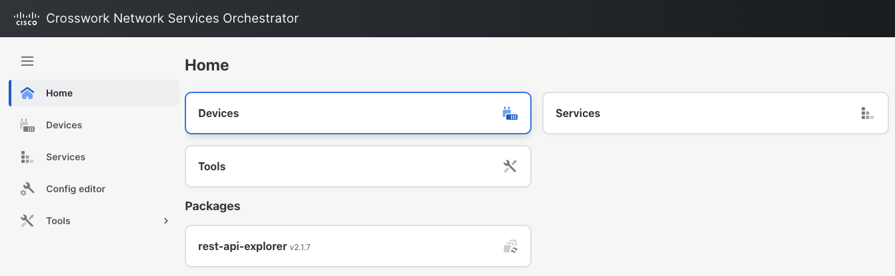

# Workshop Access & Login

## Verification

**Access GitLab**: Use the bookmarks in Google Chrome (DEVWKS-2618 folder > Web IDE) or click [GitLab](http://devtools-gitlab.lab.devnetsandbox.local){:target="_blank"} to open the UI. Log in with username `developer` and password `C1sco12345`.

## Examine NSO Deployment

In the Sandbox, there are three different instances of Cisco Network Services Orchestrator (NSO). These instances have been pre-provisioned with the necessary Network Element Drivers (NEDs) and configured to manage the devices in the lab topology.

For the purpose of this workshop, we will focus on two specific NSO environments:

**Development NSO:** [NSO Development](http://10.10.20.47:8080/login.html){:target="_blank"}

**Production NSO:** [NSO Production](http://10.10.20.48:8080/login.html){:target="_blank"}

The [NSO Development](http://10.10.20.47:8080/login.html){:target="_blank"} environment is used to simulate a testing environment where we can validate our changes before deploying them to the production environment. This ensures that any modifications are thoroughly tested and verified, reducing the risk of issues in the [NSO Production](http://10.10.20.48:8080/login.html){:target="_blank"} environment.

### Log into NSO

---

Select the NSO bookmark in Google Chrome or click [NSO Development](http://10.10.20.47:8080/login.html){:target="_blank"} to open the UI. Log in using the username `developer` and password `C1sco12345`.

### View devices

---

1. Navigate to the Devices tab to view the devices.
2. Ensure all devices are operational and correctly onboarded to NSO: select each device and run the Connect action.

If all steps are executed correctly, you will have completed the verification of your working environment.

---
